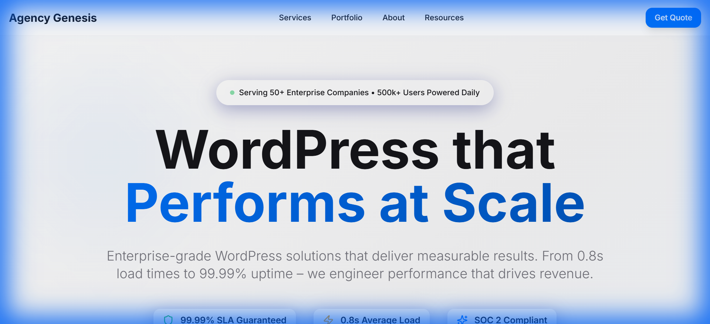

# React Agency Genesis

A premium agency funnel template with shadcn/ui, analytics dashboards, and conversion-optimized layouts.

[](./LICENSE)
[](https://react.dev)
[](https://vitejs.dev)
[](https://ui.shadcn.com)
[](https://tailwindcss.com)
[](https://www.typescriptlang.org)
[](https://www.radix-ui.com)



> **[Live Demo →](https://agency-genesis.wpagency.space)**

## Features

- **Premium Agency SPA** - Single Page Application with React Router v6 for smooth navigation
- **20+ Radix UI Components** - Accessible, unstyled primitive components for maximum customization
- **shadcn/ui Design System** - Pre-built, copy-paste component library based on Radix UI
- **React Hook Form + Zod Validation** - Powerful form management with schema validation
- **Recharts Analytics Dashboards** - Interactive data visualization and analytics views
- **Embla Carousel** - Smooth carousel and slider components
- **Command Palette** - cmdk integration for keyboard-driven navigation
- **Dark Mode** - next-themes integration for theme switching
- **Web Vitals Tracking** - Core Web Vitals monitoring and optimization
- **Conversion-Optimized Layouts** - Service pages, pricing tables, testimonials, CTAs
- **Mobile-First Design** - Responsive from 320px to 4K displays
- **TypeScript Support** - Full type safety throughout the project

## Quick Start

```bash
# Clone the repository
git clone https://github.com/wpagency/react-agency-genesis.git

# Navigate to the project
cd react-agency-genesis

# Install dependencies
npm install

# Start development server
npm run dev
```

Open [http://localhost:5173](http://localhost:5173) in your browser.

## Tech Stack

| Technology | Purpose |
|-----------|---------|
| React 18.3.1 | JavaScript UI library |
| Vite 5.4.1 | Fast build tool and dev server |
| shadcn/ui | Copy-paste component library |
| Radix UI | Accessible primitive components |
| Tailwind CSS 3.4.11 | Utility-first CSS framework |
| React Router v6 | Client-side routing |
| TanStack Query | Server state management |
| Recharts | React charting library |
| React Hook Form 7.x | Performant form handling |
| Zod | TypeScript-first schema validation |
| TypeScript 5.5.3 | Type-safe development |

## Project Structure

```
react-agency-genesis/
├── src/
│   ├── components/      # shadcn/ui and custom components
│   ├── pages/           # Route page components
│   ├── hooks/           # Custom React hooks
│   ├── lib/             # Utility functions and helpers
│   ├── types/           # TypeScript type definitions
│   ├── store/           # State management (if needed)
│   ├── assets/          # Images and media files
│   ├── styles/          # Global styles
│   ├── App.tsx          # Main app component
│   └── main.tsx         # Application entry point
├── public/              # Static assets
├── index.html           # HTML entry point
├── vite.config.ts       # Vite configuration
├── tailwind.config.js   # Tailwind CSS configuration
└── package.json         # Project dependencies
```

## Environment Variables

Copy `.env.example` to `.env.local` and fill in your values:

```bash
cp .env.example .env.local
```

Available options:

```env
# Site Configuration
VITE_SITE_TITLE=React Agency Genesis
VITE_SITE_DESCRIPTION=Premium agency funnel template
VITE_SITE_URL=https://your-domain.com

# API Configuration
VITE_API_BASE_URL=https://api.your-domain.com

# Analytics (Optional)
VITE_GOOGLE_ANALYTICS_ID=UA-XXXXXXXXX-X

# Email Configuration
VITE_CONTACT_EMAIL=contact@your-domain.com
```

See [.env.example](./.env.example) for all available options.

## Scripts

| Command | Description |
|---------|------------|
| `npm run dev` | Start local development server on port 5173 |
| `npm run build` | Build for production to `dist/` directory |
| `npm run preview` | Preview production build locally |
| `npm run type-check` | Check for TypeScript errors |
| `npm run lint` | Run ESLint on source files |

## Customization

### Design System

Edit `tailwind.config.js` to customize colors and spacing:

```javascript
theme: {
  colors: {
    primary: '#3B82F6',
    secondary: '#8B5CF6',
    accent: '#EC4899',
  },
}
```

### Adding Components

Use the shadcn/ui CLI to add components:

```bash
npx shadcn-ui@latest add button
npx shadcn-ui@latest add card
npx shadcn-ui@latest add form
```

Or copy components directly from [shadcn/ui documentation](https://ui.shadcn.com/docs/components).

### Service Pages

Create new service pages in `src/pages/`:

```typescript
// src/pages/ServicePage.tsx
import { Button } from '@/components/ui/button';
import { Card } from '@/components/ui/card';

export default function ServicePage() {
  return (
    <div>
      <h1>Service Name</h1>
      <p>Service description...</p>
      <Button>Get Started</Button>
    </div>
  );
}
```

### Forms with Validation

Create forms using React Hook Form + Zod:

```typescript
import { useForm } from 'react-hook-form';
import { zodResolver } from '@hookform/resolvers/zod';
import { z } from 'zod';

const schema = z.object({
  email: z.string().email(),
  message: z.string().min(10),
});

export default function ContactForm() {
  const { register, handleSubmit, formState: { errors } } = useForm({
    resolver: zodResolver(schema),
  });

  return (
    <form onSubmit={handleSubmit(onSubmit)}>
      <input {...register('email')} />
      <textarea {...register('message')} />
      <button type="submit">Submit</button>
    </form>
  );
}
```

### Analytics Dashboards

Create data visualizations with Recharts:

```typescript
import { BarChart, Bar, XAxis, YAxis } from 'recharts';

const data = [
  { name: 'Jan', value: 400 },
  { name: 'Feb', value: 300 },
];

export default function Dashboard() {
  return (
    <BarChart width={600} height={300} data={data}>
      <XAxis dataKey="name" />
      <YAxis />
      <Bar dataKey="value" />
    </BarChart>
  );
}
```

### Dark Mode

Toggle dark mode using next-themes:

```typescript
import { useTheme } from 'next-themes';

export default function ThemeToggle() {
  const { theme, setTheme } = useTheme();

  return (
    <button onClick={() => setTheme(theme === 'dark' ? 'light' : 'dark')}>
      Toggle Theme
    </button>
  );
}
```

## Deployment

### Netlify

1. Connect your GitHub repository to Netlify
2. Configure build settings:
   - Build command: `npm run build`
   - Publish directory: `dist`
3. Deploy

### Vercel (Recommended for React SPAs)

```bash
npm i -g vercel
vercel
```

### GitHub Pages

Update `vite.config.ts` with your base path and deploy via GitHub Actions.

## Performance

This theme achieves excellent performance metrics:

- **Lighthouse Performance**: 95+/100
- **First Contentful Paint (FCP)**: < 1.5s
- **Largest Contentful Paint (LCP)**: < 2.0s
- **Cumulative Layout Shift (CLS)**: < 0.1
- **Time to Interactive (TTI)**: < 3.0s

## Browser Support

- Chrome (latest)
- Firefox (latest)
- Safari (latest)
- Edge (latest)

## Other Themes in This Collection

| Theme | Description | Demo |
|-------|------------|------|
| [Astro Brutalfolio](https://github.com/wpagency/astro-brutalfolio) | Brutalist multilingual portfolio | [Demo](https://brutalfolio.wpagency.space) |
| [Astro Romance](https://github.com/wpagency/astro-romance) | Romantic pink agency theme | [Demo](https://astro-romance.wpagency.space) |
| [Astro Starter](https://github.com/wpagency/astro-starter) | Full-featured Astro starter with Three.js | [Demo](https://astro-starter.wpagency.space) |
| [React Parallax Foundry](https://github.com/wpagency/react-parallax-foundry) | 3D parallax website with R3F | [Demo](https://parallax-foundry.wpagency.space) |
| [React Pulse Robot](https://github.com/wpagency/react-pulse-robot) | WordPress showcase with Lottie | [Demo](https://pulse-robot.wpagency.space) |
| [React Rescue Odyssey](https://github.com/wpagency/react-rescue-odyssey) | Story-driven space theme with Supabase | [Demo](https://rescue-odyssey.wpagency.space) |
| [React Source Seeker](https://github.com/wpagency/react-source-seeker) | Interactive 3D storytelling with PWA | [Demo](https://source-seeker.wpagency.space) |

## Contributing

Contributions are welcome! Please see [CONTRIBUTING.md](./CONTRIBUTING.md) for guidelines.

## License

MIT License — see [LICENSE](./LICENSE) for details.

---

### Built by [WP Agency](https://wpagency.xyz) — WordPress and Beyond

With 15+ years of agency experience, we build production websites that perform. These open-source themes represent our commitment to the developer community.

**Need customization or a production build?** [Let's talk →](https://wpagency.xyz/contact)
